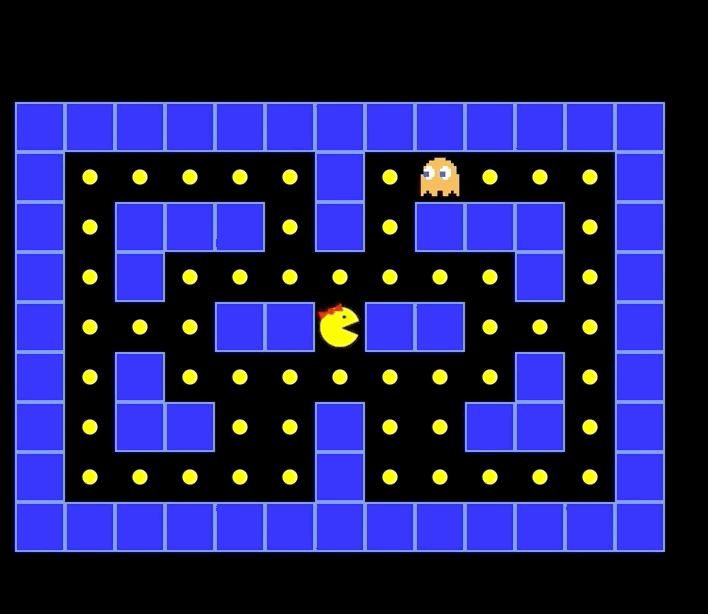

# Pacman 
[Pacman-project](https://bppandre.github.io/jsProject-pacman/)

## History

Pacman is an all time classic video game.
When it was released in 1980, the popular games were Asteroids and Space Invaders.
Pacman broke the mold, appealing to both men and women alike

Learn more about the original game : [here](https://en.wikipedia.org/wiki/Pac-Man)

## Summary



In this project, I have decided to recreate my version of the original Pacman game solely using basic web technologies i.e
Javascript, CSS and HTML.

Key features:
* Control Pacman with keyboard's keys
* Eat Food  
* Ghost chases Pacman

## Features & Implementation
Here I will go over the main features and implementation of the game.
### GameBoard
```
let gameData = [
    [1, 1, 1, 1, 1, 1, 1, 1, 1, 1, 1, 1, 1],
    [1, 2, 2, 2, 2, 2, 1, 2, 18, 2, 2, 2, 1],
    [1, 2, 1, 1, 1, 2, 1, 2, 1, 1, 1, 2, 1],
    [1, 2, 1, 2, 2, 2, 2, 2, 2, 2, 1, 2, 1],
    [1, 2, 2, 2, 1, 1, 5, 1, 1, 2, 2, 2, 1],
    [1, 2, 1, 2, 2, 2, 2, 2, 2, 2, 1, 2, 1],
    [1, 2, 1, 1, 2, 2, 1, 2, 2, 1, 1, 2, 1],
    [1, 2, 2, 2, 2, 2, 1, 2, 2, 2, 2, 2, 1],
    [1, 1, 1, 1, 1, 1, 1, 1, 1, 1, 1, 1, 1]
];


const WALL = 1;
const COIN = 2;
const GROUND = 3;
const PACMAN = 5;


const BLUE_GHOST = 15;
const RED_GHOST = 16;
const PINK_GHOST = 17;
const ORANGE_GHOST = 18;

```

The whole game is represented as a matrix (2D Array) with each numerical value corresponding to a piece of the game.
This matrix is the source of truth of the game i.e holds the state of the game at any moment.

### Pacman
```
let pacman = {
    x: 6,
    y: 4,
    direction: 'right'
};
```
Pacman's logic is a plain and simple JavaScript Object with its current coordinates (x,y) and a direction in charge of changing pacman's look when changing direction.

### Ghosts
```
let orangeGhost = {
    x:8,
    y:1,
    covering:GROUND
};
```
Ghosts are also plain Js Objects with their own current position and the underlying element of the board they are covering (ground or coin/food or power food)

#### How do they chase Pacman ?
Right now, it is a very basic implementation where the ghost takes a step toward a valid area that minimizes its distance to Pacman (with respect to the Manhattan metric)

metric distance function
```
function getDistance(ghost,pacman){
    let dx = Math.abs(ghost[1]-pacman.x);
    let dy = Math.abs(pacman.y-ghost[0]);
    return dx+dy;
}

```
movement when valid move is found 
```
function chase(ghost,target){
    let valid = allValidMoves(ghost.y,ghost.x);
    console.log(valid);
    
    let dist = valid.map(v => getDistance(v,target));
    console.log(dist);
    if(dist.indexOf(0)!==-1){
        console.log('you lost');
        
    }
    let dir = valid[dist.indexOf(Math.min(...dist))];
    console.log('min',dir);
    let x = dir[1];
    let y = dir[0];

    gameData[ghost.y][ghost.x] = ghost.covering;
    ghost.covering = gameData[y][x];
    ghost.x = x;
    ghost.y = y;
    gameData[ghost.y][ghost.x] = ORANGE_GHOST;
    eraseMap();
    drawMap();
}

```


## Future Improvements:

* [ ] Better Design for the game's page
* [ ] Control Settings for the game (play, pause , sound ...)
* [ ] Extend the game map
* [ ] Add super-food to chase ghosts
* [ ] Add ghost's behavior when being chased down
* [ ] Player's Score
* [ ] Add a more efficient search for ghosts, namely A-star implementation
* [ ] Refactor using RequestAnimationFrame

## Feedbacks and Questions <a id="contact"></a>

Feel free to reach out if you have any questions, critiques or feedbacks you'd like to share, it is always appreciated.
my [email](mailto:bobandredev@gmail.com)

